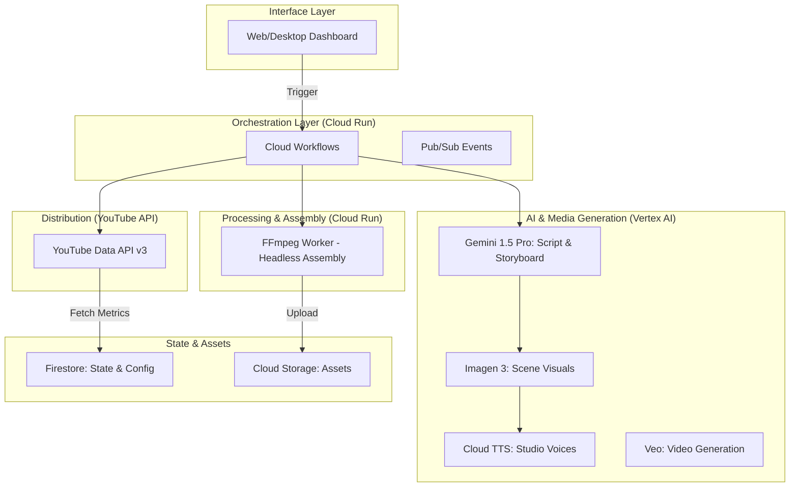

# 🎬 TariqTube 2.0: Google-Native Blueprint

## 📋 1. Current System Analysis
The current TariqTube (V1) is a **local-heavy automation suite**.
*   **Orchestration**: Local Python scripts (`story_pipeline.py`) running on a Windows PC.
*   **AI Providers**: External (OpenAI, ElevenLabs, Leonardo.AI).
*   **Automation**: High reliance on **Browser Puppeteering** (Selenium/PyAutoGUI) for account detection and posting.
*   **Storage**: Local file system (`output/` folders).
*   **State**: Local JSON files (`session_config.json`, `channel_config.json`).
*   **Risks**: Fragile UI-based automation, local compute dependency, manual session management, and limited scalability.

---

## 🏗️ 2. Target Architecture
TariqTube 2.0 will be a **fully serverless, event-driven AI Content Factory** hosted on Google Cloud.

---

## 🛠️ 3. Technology Decisions

| Component | Technology | Justification |
| :--- | :--- | :--- |
| **Brain** | Gemini 1.5 Pro | Massive context (2M tokens) allows "Long-Term Series Memory" for consistency. |
| **Visuals** | Imagen 3 / Veo | High-fidelity, Google-native generation with integrated safety filters. |
| **Voice** | Cloud TTS (Studio) | Zero-latency, professional-grade narration without third-party API costs. |
| **Compute** | Google Cloud Run | Stateless, scales to zero, perfect for batch processing videos. |
| **Storage** | Cloud Storage (GCS) | Durable, global asset hub for raw and final media. |
| **Database** | Cloud Firestore | Real-time, serverless NoSQL for project status and analytics feedback. |
| **Distribution** | YouTube API v3 | Official, stable, and authenticated via Service Accounts/OAuth. |

---

## 🔄 4. Data Flow
1.  **Request**: User submits a theme via Dashboard.
2.  **Scripting**: Gemini generates a structured JSON script (Scenes, Prompts, Narration).
3.  **Asset Gen**: Parallel execution of Google TTS (Audio) and Imagen/Veo (Media).
4.  **Assembly**: FFmpeg Worker pulls assets from GCS, assembles the video, and pushes the final `.mp4` back to GCS.
5.  **SEO**: Gemini "watches" the final video (multimodal) to generate optimized Meta-Data.
6.  **Post**: YouTube API publishes the video using a verified OAuth token.
7.  **Analytics**: Performance metrics are polled and stored in Firestore for future AI tuning.

---

## 🔐 5. Security & Credential Strategy
*   **Google Secret Manager**: All API keys and Client Secrets will be stored here.
*   **Service Account**: The Cloud Run workers will use a dedicated service account with minimally scoped roles.
*   **OAuth 2.0**: User-specific channel tokens will be managed via Google Cloud Identity and stored securely.

---

## 💰 6. Cost Considerations
*   **Free Tier Usage**: Most pipeline steps (Workflows, Cloud Run, GCS) fall within GCP free tiers for low volume.
*   **Generative Credits**: Vertex AI offers free trial credits; subsequent costs are per-token or per-image.
*   **Optimization**: Cloud Run scales to zero, ensuring no costs occur when the system is idle.

---

## 📅 7. Implementation Roadmap

### **Phase 1: Publishing Hardening (The "No-Browser" Goal)**
*   Setup Google Cloud Project.
*   Configure YouTube Data API v3.
*   Implement OAuth 2.0 flow for channel authorization.
*   **Deliverable**: A script that uploads a video via API to a selected channel.

### **Phase 2: Cloud Foundation**
*   Provision GCS Buckets for `raw`, `processed`, and `final` assets.
*   Setup Firestore for project tracking.
*   Deploy a basic "Ping" service on Cloud Run.

### **Phase 3: AI Core Migration**
*   Port story generation from OpenAI to **Gemini 1.5 Pro**.
*   Implement "Series Context" (History-aware generation).
*   Integrate Cloud TTS for narration.

### **Phase 4: Advanced Media Generation**
*   Implement Imagen 3 for cinematic scene generation.
*   (Experimental) Integrate Veo for dynamic video clips.
*   Finalize Headless FFmpeg Assembly worker.

### **Phase 5: Analytics & Closed-Loop**
*   Implement YouTube Analytics polling.
*   Gemini-driven "Performance Report" and theme optimization.

---

### **Phase 1: Publishing Hardening (The "No-Browser" Goal)**
*   [x] Setup Google Cloud Project (`tariqtube-production`).
*   [x] Configure YouTube Data API v3.
*   [x] Implement OAuth 2.0 flow for channel authorization.
*   [x] **Deliverable**: A backend token/system that uploads via API. 
*   [x] **Milestone**: Successfully ran a 2-scene "A small robot finds a flower" story from Script -> Image -> Audio -> Video -> YouTube Upload entirely via API.
*   [x] **Video URL**: [https://www.youtube.com/watch?v=bikYlOQhCQg](https://www.youtube.com/watch?v=bikYlOQhCQg) (Verified).

### **Phase 2: Cloud Foundation**
*   [x] Integrate **Gemini 3.1 Pro** for script and SEO generation.
*   [x] Integrate **Google Cloud TTS (Studio Voices)** for narration.
*   [x] Integrate **Imagen 3** for AI image generation.
*   [x] Integrate **Cloud Firestore** for project state tracking.
*   [ ] Migrate local assembly (`moviepy`) to a Cloud Run worker or Cloud Functions.

---

## 📋 8. Environment Preparation Checklist
- [x] Create GCP Project: `tariqtube-production`.
- [x] Enable APIs: Vertex AI, YouTube Data API, Cloud Run, Firestore, Secret Manager.
- [x] Create Service Account: `tariq-worker@tariqtube-production.iam.gserviceaccount.com`.
- [x] Configure OAuth Consent Screen (Completed via Browser Subagent).
- [x] Create Storage Bucket: `gs://tariqtube-assets-production`.
- [x] Create Firestore Database (Native Mode).
- [x] Prepare and Verify OAuth 2.0 Desktop Client and Token.

---

## ⚠️ 9. Risk Analysis
*   **API Limits**: YouTube has a 10,000 unit daily quota. We will implement quota-aware scheduling.
*   **Model Latency**: Video generation (Veo) can be slow. Use async polling patterns.
*   **Credential Expiry**: OAuth tokens need refreshing. Implement automated token refresh logic.

---

## 🚀 10. Migration Strategy
1.  **Parallel Run**: Keep TariqTube V1 for "Current Production."
2.  **Incremental Porting**: Build V2 components one by one.
3.  **Data Ingestion**: Copy existing project metadata from local JSON to Cloud Firestore to maintain history.
4.  **Final Cutover**: Transition UI to point to the Cloud API instead of local functions.
