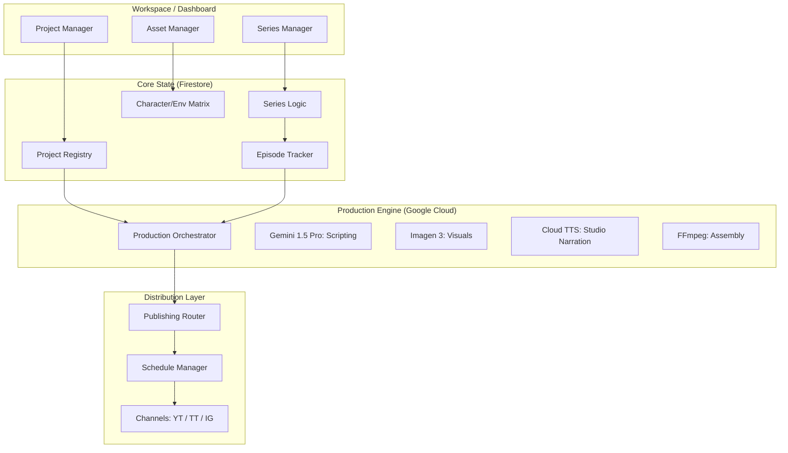

# 🎬 TariqTube 2.0: Google-Native Blueprint (Project-Centric Architecture)

## 📋 1. Core Architectural Principle
**Projects are the Source of Truth. Channels are Publishing Targets.**

The system is designed around a decoupled logic model where production state is independent of distribution destinations. This ensures that a single Project or Series can exist across multiple channels, or move between them, without losing production history or character persistence.

---

## 🏗️ 2. Primary Entities & Data Model

| Entity | Description | Level |
| :--- | :--- | :--- |
| **Workspace** | Top-level container for organizational management. | L1 |
| **Project** | **The Master Owner.** Defines category, audience, visual/narrative style, and publishing rules. | L2 |
| **Series** | Episodic grouping within a Project (Seasons, Arcs, Episode Ordering). | L3 |
| **Episode** | A structured production unit with production status, script, and meta-data. | L4 |
| **Asset** | Persistent Profiles (Characters, Environments, Voice Profiles) linked to a Project. | Asset |
| **Content Unit** | Specific media deliverables (Full Episode, Teaser, Short, Recap). | Output |
| **Channel** | A decoupled publishing destination (YouTube, TikTok, Instagram). | Target |
| **Publishing Route** | Mapping logic between a Content Unit and a specific Channel (Schedule, SEO overrides). | logic |

---

## 🗺️ 3. Target Architecture Diagram

---

## 🛠️ 4. Core App Modules

| Module | Responsibility |
| :--- | :--- |
| **Project Manager** | Definites project metadata, styles, and high-level goal (Series vs. Factory mode). |
| **Series Manager** | Manages seasons, episode ordering, release cadence, and episodic pointer. |
| **Asset Manager** | Repository for persistent character visual seeds, environments, and voice IDs. |
| **Production Engine** | Orchestrates Vertex AI services to generate scripts and media units. |
| **Publishing Router** | Maps content units to their designated channels based on Publishing Routes. |
| **Schedule Manager** | Handles timing, peak-hour posting, and task queuing. |
| **Performance Tracker** | Polls analytics and feeds "AI Performance Feedback" to the Project level. |

---

## 🔄 5. Multi-Type Content Logic
A single **Episode** production unit triggers multiple **Content Units**:
1.  **Full Episode**: Primary 16:9 or 9:16 story.
2.  **Teaser**: 15-30s hook for social promotion.
3.  **Highlight Short**: Cinematic high-action snippet.
4.  **Recap/Companion**: Summaries for series followers.

---

## 📅 6. Execution Roadmap (Revised)

### **Phase 1: Project-Centric Foundation**
*   [x] Setup Google Cloud Project (`tariqtube-production`).
*   [ ] Initialize Firestore Schema: `workspaces`, `projects`, `series`, `episodes`, `assets`.
*   [ ] Implement **Asset Manager** Prototype for character persistence.

### **Phase 2: Production Hardening** (Verified via Proto)
*   [x] Verify Gemini 1.5 Pro for multi-scene scripting.
*   [x] Verify Imagen 3 for style-consistent frame generation.
*   [x] Verify Cloud Studio TTS for character-locked narration.
*   [x] Verify YouTube API v3 for headless distribution.

### **Phase 3: Router & Schedule Implementation**
*   Develop the **Publishing Router** to handle Project -> Channel mappings.
*   Implement **Schedule Manager** for automated release cadences.

---

## 🔐 7. Security & Credential Strategy
*   **Google Secret Manager**: Master storage for Channel OAuth tokens and API secrets.
*   **Role-Based Access**: Production Engine service accounts separated from Publishing Router accounts.

---
*Blueprint Version: 2.1 (Project-Centric focus)*
